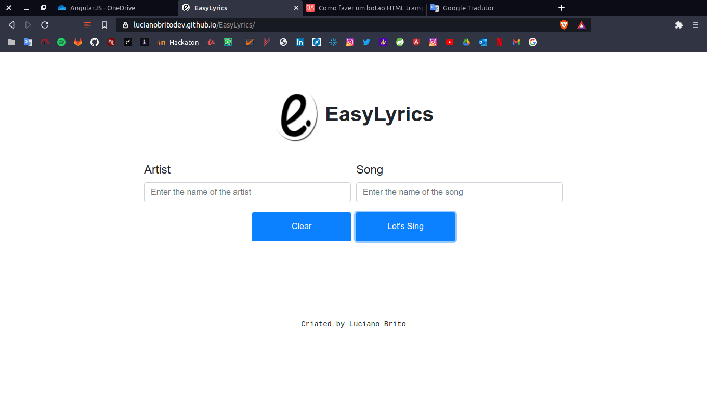

# EasyLyrics

## Function:

[EasyLyrics](https://lucianobritodev.github.io/EasyLyrics/) é uma aplicação simples de busca por letras de canções. Internamente o EasyLyrics faz uso da api rest [lyricsovh](https://lyricsovh.docs.apiary.io/),bem como da linguagem JavaScript(ES6) e dos conceitos mais atuais da linguagem como promises, async await; consumo de rest api e bootstrap 4.

## Contributors

[Luciano Brito](https://github.com/LucianoAparecidoBritoGuedes/)

Nascido em 1991 em Luziânia-GO, Brasil. Apaixonado por tecnologia e open-source. Graduado em Análise e Desenvolvimento de sistemas pela Universidade Paulista (UNIP) em 2019.

## Contacts

- [LinkeIn](https://www.linkedin.com/in/luciano-brito-76379374/)
- [Gmail](lucianobrito.dev@gmail.com)

## Donates

